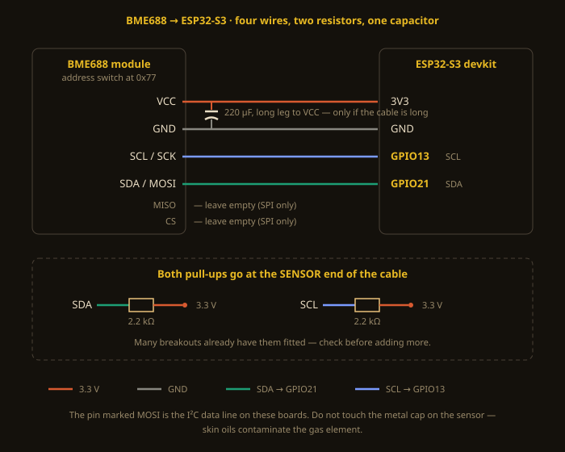

# BME688 Nose — a smell recorder you can build in an afternoon

An ESP32-S3, a Bosch BME688, four wires. The board runs Bosch's BSEC2 library,
keeps the last few hundred **fingerprints** in memory, and serves its own web page
with live charts. No broker, no database, no server, no cloud account — browse to the
board's address and it is all there.

> The page is served by the board itself — no screenshot here yet; browse to it and you will see it.

## What it records

The BME688's gas element sits on a heater that steps through ten temperatures, about
11 seconds for the set. Different compounds react most strongly at different
temperatures, so one scan yields **ten resistances — a fingerprint** — rather than a
single air-quality number. Shape is the information.

The page shows:

- **Fingerprint now** — the ten heater steps of the latest scan
- **Fingerprint over time** — a spectrogram, one column per scan, each row a heater step
- **Smell intensity** — how strong the air is against the cleanest air in view
- **Recurring patterns** — scan shapes grouped automatically, so a new kind of air shows
  up as a new cluster before you have trained anything
- **Labels** — stamp what is happening, stored on the board and marked on the spectrogram
- **Export** — JSON or CSV, in a documented format, ready for analysis or sharing

## What it cannot do

Worth knowing before you build it:

- **It does not identify compounds.** It has no idea what "coffee" is. It reports how a
  mixture of unknown volatiles affects one heated surface. Meaning comes only from
  labelled examples you collect.
- **It has no absolute scale.** Readings depend on the individual chip, its burn-in age,
  the enclosure, the temperature and the humidity. Two sensors will not agree on
  numbers — though they will agree on shapes.
- **Smells do not add.** Two compounds present together compete for the same sensing
  surface; A + B is not A's fingerprint plus B's. A mixture has to be learned as its own
  thing.
- **It needs burn-in.** Bosch advise 24–48 hours of continuous running on a new sensor
  before the gas readings settle.

## The burst cycle — the thing that will fool you

BSEC scan mode does not run continuously. It scans a few times, then rests for about a
minute and a half. During the rest the sensing surface recovers, so **the first scan
after a pause reads several times higher** than the last one before it. Measured on one
node: bursts of five scans, a 150 s cycle, roughly a tenfold peak-to-trough swing.

That is larger than most smells produce. Every scan here records its position in the
burst; the page hides position 1 by default ("settled scans only") and the export keeps
every scan with its `burst_pos`, so a training tool can use it as a feature rather than
learning it as hidden variance.

## Build it

1. [WIRING.md](docs/WIRING.md) — four wires, two pull-ups, one capacitor
2. [BUILD.md](docs/BUILD.md) — Arduino IDE setup, the one library, flashing
3. [USAGE.md](docs/USAGE.md) — recording a session and what the charts mean

## Contribute what it records

Sessions export in the [Apiary Nose](https://github.com/winreboot/apiary-nose) format —
an open dataset of beehive smells collected from working hives. A metal-oxide sensor's
readings are specific to its own chip, so a model that generalises needs data from many
sensors and many places. If you record something interesting, that project would like to
have it.

## Licence

MIT. Do what you like with it.
